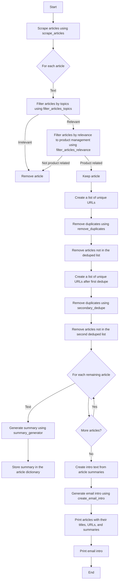

## Description
Product management is a field that is rife with long-form and strategic content. But when I went looking for real-time news through the lens of product management, I couldn't find anything. It looked like this could be an area of opportunity for someone to fill. But there was a second problem, I wanted to be a consumer of this material, not a creator. So I decided to see if AI could use crowd-sourced content to create a newsletter that I would want to read every day. This experiment with AI has become [The PM A.M. Newsletter](https://pmnews.today). Each day this code delivers an email to my inbox with the latest news that product managers should care about in a Hackernews/Reddit aesthetic.

If you are a product manager or are interested in product, you should [subscribe](https://pmnews.today).

While I have targeted it to deliver product management content, the prompts and sources could easily be tweaked to cover any topic or domain. Hopefully others take this code and create newsletters about whatever matters most to them.

## How It Works
The newsletter is built by grabbing content from various sources, filtering it and summarizing it with GPT, and then ultimately sending to subscribers using SendGrid. This diagram shows the various content flows in detail:

Here's a detailed view of the steps that selects which articles to include, summarizes each one, and creates the newsletter intro:

You can read more details on how the GPT prompts work [here](https://world.hey.com/haws/i-taught-a-robot-to-read-the-news-so-i-don-t-have-to-e2e4e2ae).

## Features
This describes some of the key features of how the code works to ultimately generate an email.

- **Scraping (API and Web-based)**: We start with a set of sources that provide high signal on technology news. They either use reader votes to surface the best stories or use human editors. For each of these sources we grab a large set of URLs. Each URL is first checked against its robots.txt file to confirm they allow scraping, those that don't are thrown out.
- **GPT Deduping**: We start off by scraping a ton of sources. This often leads to multiple sources for a single story. GPT reads all the URLs and uses the keyword in them to determine which links contain unique content. In cases where there is more than 1 url for a source, GPT uses its knowledge of [domain authority](https://moz.com/learn/seo/domain-authority) to select the best source. This avoids the need to use a more expensive domain authority tool.
- **GPT Filtering**: The text of the de-duplicated URLs is sent to the GPT API and it determines if a story is/isn't relevant to product management. It returns a keyword that allows for filtering out of non-product management stories.
- **GPT Summaries**: For all the relevant stories the text is again sent to GPT and it produces a summary of the article. These summaries are sent to GPT once more to generate an introduction for the email.
- **Email Inbox Scraping**: In the case of most existing newsletters, they do not allow scraping on their website. So I subscribed to them using a dedicated Gmail inbox. I then get the links and text needed from the inbox rather than the website.

## Files
This describes the role of each file in creating the newsletter.
- **email_generator**: This is the file that controls the run of the email send. It pulls in the content, formats in HTML, and sends it through the [SendGrid API](https://docs.sendgrid.com/for-developers/sending-email/api-getting-started). This is also where you set the timing of the send. The python version is included here, but I ultimately used Flask for this so that I could have both the daily send and another endpoint to manually trigger  when needed.
- **current_news_scrapers**: This file is the start of the daily news flow. Here we designate the sources we want to scrape with their specific scraping code. This file also contains a variable that allows you to adjust how many urls are pulled from each source.
- **scrape_articles**: This files checks each URL against its robots.txt file. For those that allow scraping it creates a dictionary that contains the url, the article title, and the text of the article. Unlike the current_news_scrapers where we only need to account for a few webpage layouts, there can be literally 100's of page layouts. Newspaper3k was a huge help here as I did not need to try and write scrapers for each possible source.
- **summary_generator**: This takes the dictionary created in scrape_articles and passes the contents through GPT several times. The output is a summary for each article relevant to product management. Additionally, the summaries are combined with a prompt and theme that is unique to the day of the week, to create an intro for the email (assuring the the intro will almost never be similar).
- **get_bcc_contacts**: Sendgrid is overall easy to use but it has a few quirks. In the case of the email send API, it expects you to provide it with a list of emails. If you are using SendGrid to collect you audience emails you would expect you could reference them directly in the send, but it does not allow for this. So this file reaches out to SendGrid and grabs the emails in your audience list, they are then used at the time of send.
- **long_form_scraper**: This file grabs content that was sent to a Gmail inbox. It allows you to specify which senders you would like to pull content from. You will need to setup a [Gmail Project](https://developers.google.com/gmail/api/quickstart/python) if you want to use this functionality.
- **product_hunt_scraper**: This file scrapes the top products from the front page of Product Hunt. The various elements are not stored in an easy to access manner, so it also recombines them after they are pulled.
- **reddit_scraper**: This file grabs the top discussions from a specific subreddit, in our case r/productmanagement. You will need a [Reddit API Account](https://www.reddit.com/dev/api/) if you want to use this functionality

Note: each file that grabs content contains a variable that allows you to set the window of time for which to scrape content. By default they are all set to the last 24 hours.

## Setup
The compute demands for this are almost nothing since it its just stringing together APIs. I deployed this on a free Flask server. But it could be deployed on almost any machine running python and Flask. I wrote it all in plain python but switched to Flask for creating endpoints for testing and the recurring run. Needed packages can be installed using this command:
  <pre><code>pip install flask openai pytz google-auth google-auth-oauthlib google-auth-httplib2 google-api-python-client bs4 newspaper sendgrid praw </code></pre>

  Key Packages/Tools:
  - [OpenAI](https://platform.openai.com/overview): Used for accessing gpt-3-turbo
  - [Newspaper3k](https://pypi.org/project/newspaper3k/): Used for parsing and scraping content from webpages
  - [Beautiful Soup](https://beautiful-soup-4.readthedocs.io/en/latest/): Used for parsing and scraping content from webpages
  - [SendGrid](https://docs.sendgrid.com/for-developers/sending-email/api-getting-started): Used for sending emails and managing audience
  - [Gmail API](https://developers.google.com/gmail/api/quickstart/python): Used for capturing and scraping newsletter content
  - [Reddit API](https://www.reddit.com/dev/api/)(praw):Used to scrape content from Reddit
  - [Carrd](https://carrd.co): Hosts the newsletter sign up page

## Roadmap
- Generalize all scrapers into a single class to make adding new sources easier
- Add longform content to daily sends (waiting to see if this content makes sense/is in demand)
- Implement fine tuning to increase the quality of both the articles included and the article summaries
- Store outputs of the newsletter and feed into GPT to see if it can spot upcoming trends in product management

## Acknowledgements
- Huge thanks to my wife Kasey! She did a ton to help with this, weighing in on design and being my first tester. She always supports me, no matter what weird thing I am currently chasing.
- As always I owe [Ryan Jenson](https://www.linkedin.com/in/ryanwjenson/) big time. He helped with design and pointed me in the right direction on content. He also gave me a crash course on SEO and domain authority.

## License

This project is open source and available under the [MIT License](LICENSE).
